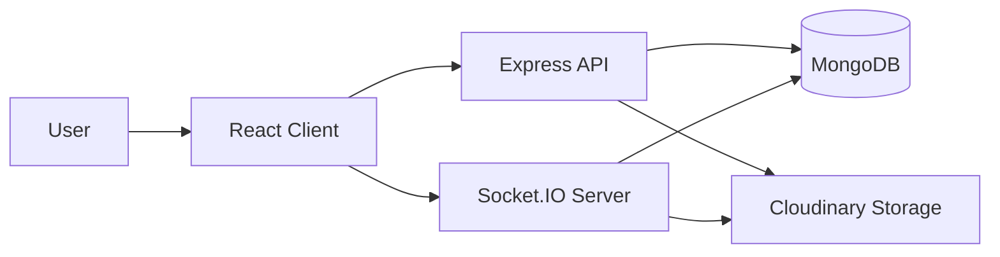
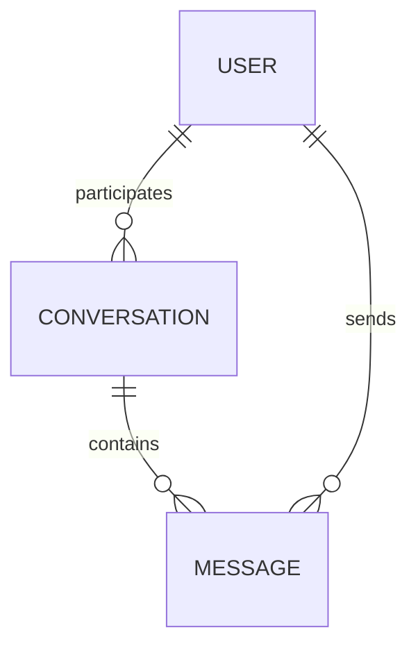

# TalkStream

TalkStream is a full-stack real-time chat application built with React, TypeScript + Express on Node.js, MongoDB, and Socket.IO. The project currently supports authenticated users, one-to-one conversations, real-time messaging, typing indicators, delivery/seen state, and media/file uploads to Cloudinary.

## Overview

TalkStream is a lightweight messaging platform designed for authenticated users to exchange text and media in real time. The implementation combines a React client with a TypeScript/Express backend and a MongoDB data layer, using Socket.IO for low-latency event delivery and presence updates.

The backend is written entirely in TypeScript and is located under `server/src/`. It is compiled using `tsc` into `server/dist/`. The codebase follows a structured routes → controllers → services architecture, with shared types, enums, and middleware used across the application.

The application is organized around three primary concerns:

- A React frontend for conversation UI, authentication, and real-time interactions
- A TypeScript + Express API on Node.js for user, conversation, message, and upload operations
- A Socket.IO layer for live message delivery, typing indicators, online presence, and message status updates

## Key Features

### Messaging

- User sign-up and login with JWT-based authentication
- Conversation creation and retrieval for authenticated users
- Message history loading with pagination support
- Message editing and deletion
- Delivery and read-state tracking using persisted message metadata

### Real-Time Features

- WebSocket-based instant message delivery
- Online/offline presence tracking
- Typing indicators for active conversations
- Conversation-room joining and leaving
- Real-time synchronization of message state across clients

### Media and Files

- File upload support for images, videos, and documents
- Cloudinary-backed storage for uploaded media
- In-chat preview for image/video/file attachments
- Pending upload state and optimistic UI rendering for better UX

## Architecture



### Component Responsibilities

- Frontend: renders the landing experience, authentication pages, and the conversation UI
- API layer: Express routers and controllers handle authentication, user lookup, conversation management, message retrieval, and file uploads
- Service layer: typed service modules hold the business logic and all Mongoose data access, keeping controllers thin
- Socket layer: manages real-time chat events, presence, typing notifications, and message status updates
- Database: stores users, conversations, and messages
- Storage: hosts uploaded media files through Cloudinary

## Technology Stack

| Layer | Technology | Purpose |
| --- | --- | --- |
| Frontend | React 18, React Router, Tailwind CSS | User interface and routing |
| Client State | Zustand | Global auth and chat state |
| Backend | Node.js, Express.js, TypeScript | REST API and server runtime |
| Backend Language | TypeScript (strict mode, ES2022, NodeNext modules) | Static typing across the server codebase |
| Database | MongoDB, Mongoose | Persistent chat data storage |
| Real-Time | Socket.IO | Live messaging and presence |
| Authentication | JWT, bcryptjs | Session tokens and password hashing |
| File Storage | Cloudinary, Multer | Image, video, and document upload hosting |
| Validation | express-validator, Zod | Request input validation and environment variable validation |
| Backend Tooling | ts-node-dev, ESLint (typescript-eslint), Prettier | Dev server with hot reload, linting, and formatting |
| Testing | React Testing Library | Frontend smoke tests |

### Important Directories

- client/src/conversations/: chat UI, message bubbles, input bar, conversation list, and room state
- client/src/store/: Zustand stores for authentication and chat state
- client/src/socket/: Socket.IO client initialization
- server/src/routes/: API routing, validation chains, and middleware wiring
- server/src/controllers/: request handlers for users, conversations, messages, and uploads
- server/src/services/: business logic and database access for auth, users, conversations, messages, and uploads
- server/src/models/: Mongoose schemas and TypeScript interfaces for User, Conversation, and Message
- server/src/middleware/: authentication, request validation, and error-handling middleware
- server/src/socket/: real-time server event logic
- server/src/config/: environment schema, MongoDB connection, and Cloudinary setup
- server/src/types/: shared request/response and socket payload types, plus Express request augmentation
- server/src/enums/: shared enums such as MessageType
- server/src/utils/: helpers such as JWT signing and verification
- server/dist/: compiled JavaScript output produced by `npm run build`

## System Architecture / Data Flow

### Sending a Message

```text
User
  ↓
React UI
  ↓
Zustand chat store
  ↓
Socket.IO emit: sendMessage
  ↓
Socket server
  ↓
MongoDB persistence
  ↓
Realtime broadcast to recipient and sender
```

### Receiving a Message

```text
Sender/recipient socket event
  ↓
Socket.IO server
  ↓
Client receiveMessage listener
  ↓
Local chat state update
  ↓
Conversation list and unread counter refresh
```

### Creating a Conversation

```text
Authenticated client
  ↓
POST /api/conversations/start
  ↓
Server checks participant validity
  ↓
MongoDB conversation document created or reused
  ↓
Conversation returned to client
```

### Authentication Flow

```text
Login/signup form
  ↓
API request
  ↓
JWT issued by backend
  ↓
Client stores token and user data
  ↓
Protected API and Socket.IO access are authorized
```

### Media Upload Flow

```text
Client selects file
  ↓
Upload route POST /api/upload
  ↓
Multer buffer handling
  ↓
Cloudinary upload
  ↓
File URL returned to client
  ↓
Socket message emitted with file metadata
```

## Real-Time Communication

The application uses Socket.IO for real-time chat transport. The server initializes the Socket.IO instance in server/src/socket/socket.ts (via the `initSocket` function called from server/src/server.ts) and attaches authentication via the socket handshake token. Socket event payloads are typed in server/src/types/socket.types.ts.

### Connection Model

- The client connects with a JWT passed as a query parameter
- The server verifies the token and attaches the authenticated user ID to the socket
- A personal room is created for each user using the namespace user:<userId>
- Conversation-specific rooms are joined when a user opens a conversation

### Real-Time Behavior

- Newly sent messages are broadcast to both the sender and the receiving participant
- Delivery state is updated when the recipient is online
- Seen state is updated when the recipient marks messages as read
- Typing state is emitted while the input field is active and suppressed after a short inactivity window

## Authentication & Security

Authentication and basic application security are implemented in the current codebase.

### Implemented Measures

- JWT-based authentication for REST API routes
- Bearer token validation in auth middleware (server/src/middleware/auth.middleware.ts), which distinguishes expired tokens (401) from malformed ones (400)
- The decoded JWT payload is attached to `req.user` through a typed Express request augmentation
- Password hashing using bcryptjs in a pre-save hook on the User model
- Input validation for auth routes using express-validator plus a shared validateRequest middleware
- Startup validation of all required environment variables with a Zod schema; the process exits if any are missing or malformed
- Protected routes for conversations, messages, and uploads
- Socket.IO authentication using the same JWT token, with participant checks before joining a conversation room
- CORS restricted to the configured CLIENT_URL for both Express and Socket.IO
- File upload size (20 MB) and MIME allowlist restrictions

### Notes

- The client stores auth state in browser local storage
- Token expiry is checked client-side using jwt-decode
- Refresh token flow is not implemented in the current codebase
- Password reset and email verification flows are not identified in the repository
- helmet, compression, and morgan are present in server dependencies but are not currently wired into server/src/app.ts

## Database Design

The database is MongoDB-backed and uses Mongoose schemas. Each model in server/src/models/ pairs its schema with an exported TypeScript interface (User, Conversation, Message) and is created as a typed `Model<T>`, so documents are type-checked across services and socket handlers.




## State Management

The client uses Zustand for state management.

### Auth State

- Managed in client/src/store/authStore.js
- Stores the JWT token and authenticated user profile
- Persists to local storage and clears on logout

### Chat State

- Managed in client/src/store/chatStore.js
- Maintains conversations, active conversation, users, messages, unread counts, typing state, pending uploads, and online user IDs
- Updates are driven by REST responses and Socket.IO events

## Environment Configuration

The application expects environment variables for both the server and the client.

### Server

Server environment variables are parsed and validated at startup by a Zod schema in server/src/config/env.ts. The server logs the validation errors and exits if a required value is missing or invalid, so all of the following must be present except where a default is noted.

```env
PORT=5000
MONGO_URI=mongodb://localhost:27017/your-database
JWT_SECRET=replace-with-a-secure-secret
JWT_EXPIRES_IN=7d
CLIENT_URL=http://localhost:3000
API_BASE_URL=http://localhost:5000/api
CLOUDINARY_CLOUD_NAME=your-cloud-name
CLOUDINARY_API_KEY=your-api-key
CLOUDINARY_API_SECRET=your-api-secret
UPLOAD_PRESET=your-upload-preset
```

- PORT defaults to 5000, JWT_EXPIRES_IN defaults to 7d, and API_BASE_URL defaults to http://localhost:5000/api
- CLIENT_URL and API_BASE_URL must be valid URLs
- Application code reads configuration through the typed `env` object rather than `process.env`

### Client

```env
REACT_APP_API_URL=http://localhost:5000/api
REACT_APP_SOCKET_URL=http://localhost:5000
```

## Installation & Setup

### Prerequisites

- Node.js and npm
- A running MongoDB instance
- A Cloudinary account for media upload hosting

### Installation

```bash
cd server
npm install

cd ../client
npm install
```

### Environment Setup

Create a .env file in server/ and client/ with the variables listed above.

### Database Setup

No migration framework is configured. The application creates and uses MongoDB collections via Mongoose models at runtime, so a reachable MongoDB instance is sufficient for local development.

### Development

Run the backend in watch mode. `npm run dev` uses ts-node-dev, so TypeScript sources are executed directly and the server respawns on change without a manual build:

```bash
cd server
npm run dev
```

Run the frontend:

```bash
cd client
npm start
```

### Production Build

Build the backend with the TypeScript compiler, then run the compiled output from `server/dist/`. `npm start` no longer runs TypeScript sources directly, so `npm run build` must be executed first:

```bash
cd server
npm run build
npm start
```

Build the frontend:

```bash
cd client
npm run build
```

### Backend Scripts

| Script | Command | Purpose |
| --- | --- | --- |
| `npm run dev` | ts-node-dev on src/server.ts | Development server with hot reload |
| `npm run build` | tsc | Compile TypeScript from src/ to dist/ |
| `npm start` | node dist/server.js | Run the compiled production server |
| `npm run lint` | eslint . | Lint the TypeScript sources |
| `npm run lint:fix` | eslint . --fix | Lint and auto-fix |
| `npm run format` | prettier --write . | Format sources |
| `npm run format:check` | prettier --check . | Verify formatting |

## Development Workflow

A typical local development workflow is:

1. Start MongoDB
2. Start the backend API and Socket.IO server
3. Start the React client
4. Create or sign in to a user account
5. Start a conversation and verify message delivery and typing behavior

## Testing

The repository currently contains a basic frontend test setup.

### Existing Tests

- React Testing Library is installed and configured
- A basic smoke test exists in client/src/App.test.js

### Running Tests

```bash
cd client
npm test
```

### Backend Tests

No automated backend test suite is currently defined. The backend `test` script still returns a placeholder message and exits non-zero. In the absence of tests, `cd server && npm run build` doubles as a static check, since `tsc` runs in strict mode with `noUnusedLocals` and `noUnusedParameters` enabled and will fail on type errors.

## Error Handling & Logging

The application includes basic error-handling paths:

- Controllers wrap their service calls in try/catch and forward failures with `next(error)`
- Validation middleware returns structured validation errors
- Authentication failures return explicit 401/400 responses
- Socket handlers catch and log their own errors, and emit a `messageError` event back to the sender when a send fails
- Cloudinary upload failures are caught and surfaced to the client
- Invalid environment configuration is reported and terminates the process at startup

A typed global error handler exists at server/src/middleware/error-handler.middleware.ts, but it is currently commented out in server/src/app.ts, so forwarded errors fall through to the default Express error handler. Wiring it back in is a small, isolated change.

No centralized logging framework or observability stack was identified in the current codebase.

## Performance Considerations

The current implementation already includes several practical performance-oriented choices:

- Message history is fetched with pagination
- Conversation list data is sorted by recency
- Socket events update only the relevant local state rather than reloading the full UI
- File uploads are handled with pending-message UI and background upload processing

## Scalability Considerations

### Currently Implemented

- Stateless API and Socket.IO server design
- MongoDB-backed persistence for core chat entities
- Room-based real-time messaging model

### Potential Future Improvements

- Introduce a Redis-backed Socket.IO adapter for multi-instance deployments
- Add background job processing for heavy media workflows
- Add caching for frequently accessed conversation metadata
- Introduce a queue-based notification pipeline if push notifications are added later

## Security Considerations

The following security practices are implemented in the repository:

- JWT-based authentication
- Password hashing with bcryptjs
- Protected API endpoints and socket authorization
- Input validation through express-validator
- File upload restrictions for size and MIME type

Sensitive values should remain in environment variables and should not be committed to source control.

## Troubleshooting

### Backend cannot connect to MongoDB

- Verify that MONGO_URI points to a reachable MongoDB instance
- Confirm the database server is running and reachable from the backend environment

### Socket.IO connection fails

- Confirm the client is sending a valid JWT token
- Verify that the server and client socket URLs are aligned with the configured environment values
- Check that the backend server is running and that CLIENT_URL is set correctly

### File upload fails

- Confirm Cloudinary credentials are present and valid
- Check that the file type is within the allowed MIME allowlist
- Ensure the upload size is below the 20MB limit

### Backend starts but exits immediately

- Check the console for the "Invalid Environment Variables" report; the Zod schema in server/src/config/env.ts exits the process when a required variable is missing or malformed
- Confirm CLIENT_URL and API_BASE_URL are full, valid URLs

### `npm start` fails on the server with a missing dist/server.js

- Run `npm run build` in `server/` first; `npm start` executes the compiled output, not the TypeScript sources
- Use `npm run dev` for local development to skip the build step

## Build & Run Summary

```bash
cd server
npm run build
npm start

cd client
npm run build
```

## Testing & Linting
- Frontend tests: `cd client && npm test` (Create React App test runner)
- Backend: no automated tests available in the repository (server/package.json `test` prints a placeholder)
- Backend type check: `cd server && npm run build` (strict `tsc` compile)
- Lint/format: `cd server && npm run lint` / `npm run format`

## Security (implemented)
- JWT authentication with `Authorization: Bearer <token>` header
- Password hashing using `bcryptjs` in `User` model pre-save hook
- Validation with `express-validator` for routes and `zod` for environment variables
- File upload size limit (20 MB) and MIME allowlist enforced in upload route
- CORS configured for `CLIENT_URL` in both Express and Socket.IO

## Scalability & Future Improvements
- Currently implemented: stateless API, Mongoose persistence, room-based Socket.IO model
- Recommended improvements (not implemented):
  - Add Redis adapter for Socket.IO for multi-instance horizontal scaling
  - Add background processing (worker queue) for heavy media tasks
  - Add centralized logging/observability

## Contributing
- Backend changes are TypeScript only and belong under `server/src/`. Do not edit `server/dist/`; it is compiler output.
- Follow existing code style (Prettier + ESLint with typescript-eslint). Run `npm run lint` and `npm run format` in `server/` before PRs.
- Confirm `npm run build` compiles cleanly in `server/` before opening a PR.
- Open issues for bugs or feature requests and create focused PRs.

## License
This repository does not contain a license file. Add a `LICENSE` if you intend to open-source the project.

---

If you want, I can add an `.env.example` snippet, run TypeScript compilation, or expand the README with deployment instructions.
